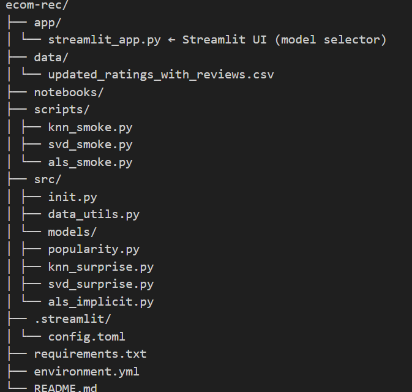

# Intelligent E-Commerce Recommendation System

A full demo of different recommendation algorithms for an e-commerce dataset.  
It reproduces the structure and flow of the original project while keeping it Windows-friendly.

---

## 💡 Models implemented
| Category | Library | Description |
|-----------|----------|--------------|
| **Popularity** | pandas | Global average-rating baseline |
| **KNN** | Surprise | User-based / item-based collaborative filtering |
| **SVD** | Surprise | Matrix factorization on explicit ratings |
| **ALS** | implicit | Matrix factorization for implicit feedback |

Each model can be selected in the Streamlit sidebar.

---

## 📂 Project structure
ecom-rec/


---

## 📊 Dataset
Place your CSV inside the `data/` folder.  
Expected columns:
original_user_id, product_id, rating, timestamp,
mapped_user_id, mapped_product_id, sentiment, product_review

These are standardized internally to:
userId, productId, Rating


---

## ⚙️ Setup
```bash
# clone the repo
git clone https://github.com/bhoomikaa/Intelligient-E-Commerce-Recommendation-System-.git
cd Intelligient-E-Commerce-Recommendation-System-

# create environment
conda env create -f environment.yml
conda activate ecomrec

# or install directly
pip install -r requirements.txt

